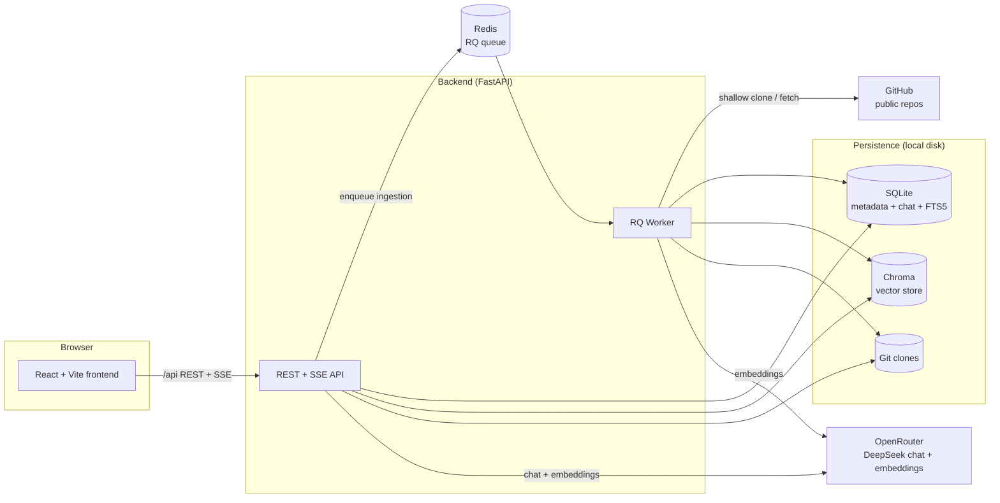
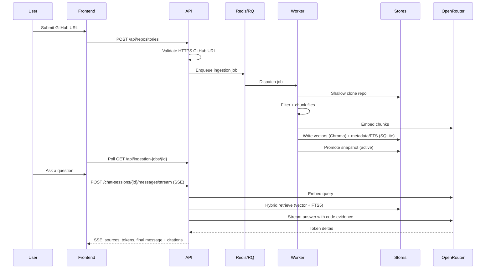

# Codebase Chat Assistant

A local, single-user RAG (retrieval-augmented generation) assistant for **public GitHub repositories**. Paste a repo URL, let it index, then ask questions like *"where is authentication handled?"* or *"how does the retrieval scoring work?"* and get concise, **cited** answers grounded in the actual source code — with inline file/line citations, expandable snippets, a read-only file explorer, and GitHub permalinks pinned to a commit SHA.

The assistant refuses to guess: when retrieval finds weak or no evidence, it returns a refusal with the closest references instead of hallucinating an answer.

> Scope is intentionally narrow: local, single-user, public repos only. No auth, no private repos, no multi-tenancy, no code execution. See [`PLAN.md`](./PLAN.md) for the full product spec and non-goals.

---

## Features

- **Ingest public GitHub repos** via strict HTTPS URL validation and shallow `git` clone.
- **Symbol-aware chunking** — splits code by functions/classes where possible, with line-window fallback for oversized symbols and unsupported file types.
- **Hybrid retrieval** — combines Chroma vector similarity with SQLite FTS5 keyword search, then lightly reranks and applies an evidence threshold.
- **Cited, streamed answers** — responses stream over SSE (token deltas, sources, final saved message) from DeepSeek via OpenRouter.
- **Incremental refresh** — compares the last indexed commit to the latest default-branch commit and re-indexes only what changed, promoting a new snapshot only after the whole job succeeds.
- **Snapshot isolation** — retrieval only ever reads the active snapshot; failed refreshes leave the previous snapshot queryable; old chat citations keep durable snippets even after vectors are garbage-collected.
- **Read-only file explorer** with previews, size limits, and "not indexed" labels for skipped files.

---

## Architecture

### High-level system



### Tech stack

| Layer | Choice |
| --- | --- |
| Backend | FastAPI (Python 3.12), packaged with `uv` |
| Background jobs | RQ + Redis |
| Metadata DB | SQLite via SQLAlchemy, migrations with Alembic |
| Vector DB | Persistent Chroma |
| Keyword index | SQLite FTS5 |
| LLM provider | OpenRouter — DeepSeek chat + embedding model (configurable) |
| Frontend | Vite, React 19, TypeScript, Tailwind CSS, React Query |
| Lint / format / types | Ruff, mypy (strict), ESLint, Prettier |

### Backend modules

The backend (`backend/app/`) is organized into deep, independently testable domain modules:

| Module | Responsibility |
| --- | --- |
| `api/` | REST + SSE endpoints, request schemas, runtime dependency wiring |
| `core/` | Env-driven settings, limits, model names, structured errors |
| `ingestion/` | GitHub URL validation, clone/fetch, commit-diff refresh planning, file filtering |
| `chunking/` | Symbol-aware chunking with line-window fallback |
| `indexing/` | OpenRouter embeddings, Chroma vector store, FTS5 keyword index, snapshot staging/promotion |
| `retrieval/` | Hybrid retrieval, score merging, evidence thresholds, citation assembly |
| `llm/` | OpenRouter chat client, prompt construction, refusal behavior |
| `chat/` | SQLite-backed chat sessions/messages store and SSE streaming orchestration |
| `files/` | Read-only repository tree + file preview APIs with path normalization |
| `jobs/` | RQ enqueue, worker entrypoint, in-memory repository registry, job state |
| `evaluation/` | Golden Q&A fixtures and success checks |

### Ingestion & query lifecycle



---

## API surface

All routes are mounted under `/api` (see `backend/app/api/routes.py`).

| Method | Path | Purpose |
| --- | --- | --- |
| `GET` | `/health` | Liveness check |
| `GET` | `/diagnostics` | Non-secret config diagnostics |
| `POST` | `/repositories` | Submit a public GitHub URL for ingestion |
| `GET` | `/repositories` | List tracked repositories |
| `GET` | `/repositories/{id}` | Get a repository's status |
| `POST` | `/repositories/{id}/refresh` | Incrementally refresh the index |
| `GET` | `/ingestion-jobs/{id}` | Poll ingestion/refresh job status |
| `POST` | `/repositories/{id}/chat-sessions` | Create a chat session |
| `GET` | `/repositories/{id}/chat-sessions` | List chat sessions |
| `PATCH` | `/chat-sessions/{id}` | Rename a chat session |
| `GET` | `/chat-sessions/{id}/messages` | List messages in a session |
| `POST` | `/chat-sessions/{id}/messages/stream` | Send a message, stream the answer over SSE |
| `GET` | `/repositories/{id}/files/tree` | Read-only repository file tree |
| `GET` | `/repositories/{id}/files/content` | Read a file preview |

Errors are consistent JSON with `code`, `message`, and optional `details`.

---

## Running locally

### Prerequisites

- [Docker](https://www.docker.com/) + Docker Compose (for the backend services), **or** local installs of Python 3.12, [`uv`](https://github.com/astral-sh/uv), Redis, and `git`.
- [Bun](https://bun.sh/) (or Node) for the frontend.
- An **OpenRouter API key** for chat + embeddings.

### 1. Configure the backend

```bash
cd backend
cp .env.example .env
```

Edit `backend/.env` and set at least:

```bash
CODEBASE_ASSISTANT_OPENROUTER_API_KEY=sk-or-...
CODEBASE_ASSISTANT_OPENROUTER_CHAT_MODEL=deepseek/deepseek-chat
CODEBASE_ASSISTANT_OPENROUTER_EMBEDDING_MODEL=openai/text-embedding-3-small
```

> The API key is **backend-only** and is never exposed to the frontend. All other settings have working defaults (see `backend/app/core/config.py`).

### 2. Start the backend (Docker Compose — recommended)

From the repo root:

```bash
docker compose up --build
```

This starts three services:

- **`api`** — FastAPI on [http://localhost:8000](http://localhost:8000)
- **`worker`** — the RQ ingestion worker
- **`redis`** — the job queue

Backend state (SQLite, Chroma, clones) persists in the `backend-data` named volume.

Verify it's up:

```bash
curl http://localhost:8000/api/health   # -> {"status":"ok"}
```

#### Alternative: run the backend without Docker

```bash
cd backend
uv sync                 # install deps into a local venv
# Terminal 1 — API
uv run uvicorn app.main:app --reload --port 8000
# Terminal 2 — worker (needs a running Redis on localhost:6379)
uv run codebase-assistant-worker
```

With the defaults in `.env.example`, backend state is written under `data/backend/` at the repo root.

### 3. Start the frontend

```bash
cd frontend
bun install
bun run dev
```

The Vite dev server runs on [http://localhost:5173](http://localhost:5173) and proxies `/api` to `http://localhost:8000` (see `frontend/vite.config.ts`), so no extra CORS or env config is needed.

Open the app, paste a public GitHub repository URL, watch the ingestion progress, and start asking questions.

---

## Development

### Backend

```bash
cd backend
uv run pytest            # run the test suite
uv run ruff check .      # lint
uv run ruff format .     # format
uv run mypy              # strict type checking
```

The pytest suite covers URL validation, file filtering, chunking, incremental refresh, indexing, retrieval/answering, chat streaming, the API surface, and golden evaluation (`backend/tests/`).

### Frontend

```bash
cd frontend
bun run lint
bun run format
bun run build
```

### Database migrations

Schema is managed with Alembic (`backend/alembic/`):

```bash
cd backend
uv run alembic upgrade head
```

---

## Repository layout

```
.
├── backend/            FastAPI app, RQ worker, ingestion/retrieval/LLM, Alembic, tests
│   └── app/
│       ├── api/        REST + SSE endpoints and runtime wiring
│       ├── chat/       Chat store + SSE streaming
│       ├── chunking/   Symbol-aware chunker
│       ├── core/       Config + structured errors
│       ├── db/         SQLAlchemy models
│       ├── evaluation/ Golden Q&A fixtures
│       ├── files/      Read-only file browser
│       ├── indexing/   Embeddings, Chroma, FTS5, snapshots
│       ├── ingestion/  GitHub clone, filtering, refresh planning
│       ├── jobs/       RQ queue + worker entrypoint
│       ├── llm/        OpenRouter chat client
│       └── retrieval/  Hybrid retrieval + answering
├── frontend/           Vite + React + TypeScript single-page UI
├── docs/               PRD, evaluation report, issue notes
├── plans/              Implementation/advisor plans
├── docker-compose.yml  api + worker + redis
└── PLAN.md             Full architecture & product plan
```

---

## Further reading

- [`PLAN.md`](./PLAN.md) — complete architecture plan, data model, and non-goals.
- [`docs/prd/`](./docs/prd/) — product requirements.
- [`docs/evaluation/`](./docs/evaluation/) — golden Q&A evaluation report.
